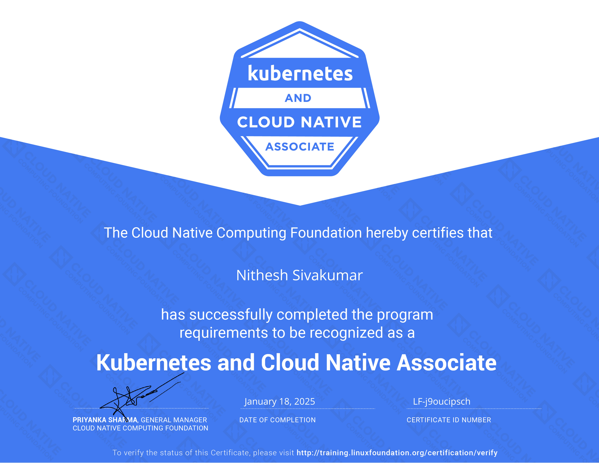
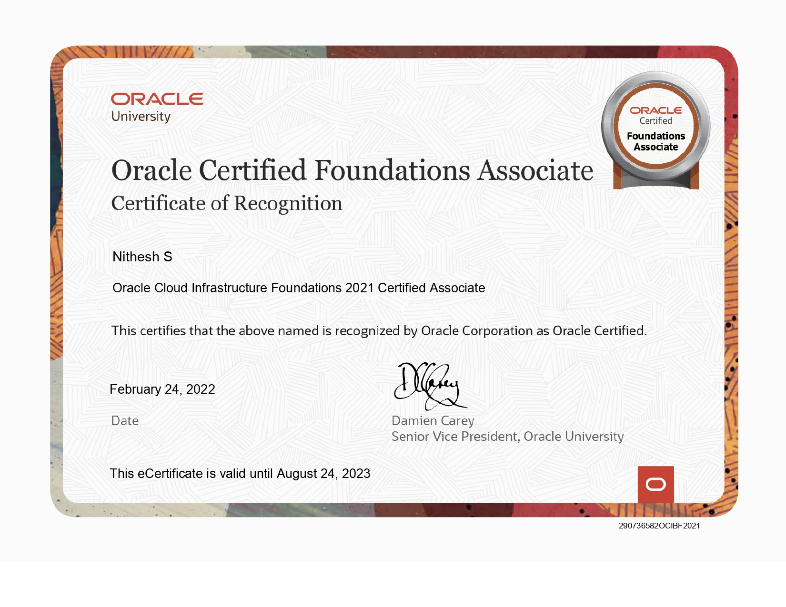

# 🏆 My Certifications

---

### 🥇 AWS Certified Solutions Architect – Associate  
**Issued:** February 11, 2022  
**Valid Until:** April 18, 2027  
**Validation Number:** `J2ZVDR2BGFV41FC9`  
🔗 [Verify](https://aws.amazon.com/verification)  

---

### 🤖 AWS Certified AI Practitioner  
**Issued:** February 13, 2025  
**Valid Until:** February 13, 2028  
**Validation Number:** `b5c823bc49464172a4c2f5536683d00f`  
🔗 [Verify](https://aws.amazon.com/verification)  

---

### ⚙️ HashiCorp Certified: Terraform Associate  
**Issued:** January 18, 2025  
**Validation Number:** `LF-j9oucipsch`  
🔗 [Terraform Verification](https://training.linuxfoundation.org/certification/terraform-associate)  

---

### 🧠 Kubernetes and Cloud Native Associate (KCNA)  
**Issued:** January 18, 2025  
**Validation Number:** `LF-j9oucipsch`  
🔗 [KCNA Verification](https://training.linuxfoundation.org/certification/kcna)  

---

### ☸️ AWS Knowledge: Amazon EKS (Learning Badge)  
**Issued by:** AWS Training and Certification  
**Issued on:** March 16, 2025  
📚 Earned for completing the Amazon EKS learning path  

---

### 🏛️ Oracle Cloud Infrastructure Foundations 2021 Certified Associate  
**Issued:** February 24, 2022  
**Valid Until:** August 24, 2023  
**Validation Number:** `290736582OCIBF2021`  

---

### 🌐 AWS Certified Cloud Practitioner  
**Issued:** December 27, 2021  
**Valid Until:** November 25, 2026  
**Validation Number:** `CLQYLRCBP1B4Q2SV`  
🔗 [Verify](https://aws.amazon.com/verification)  

---
